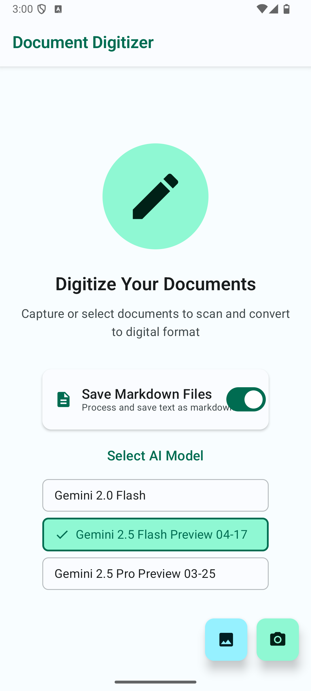
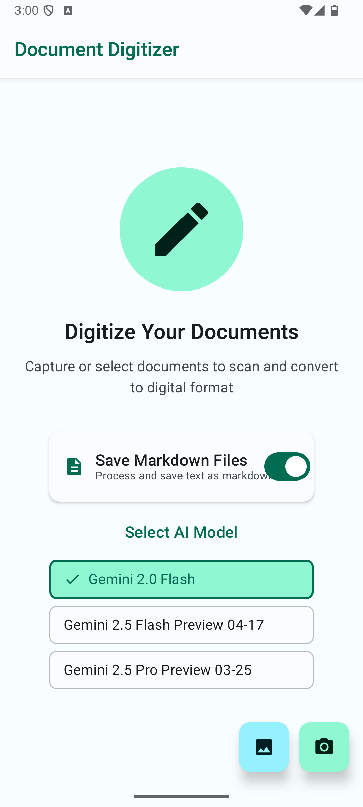
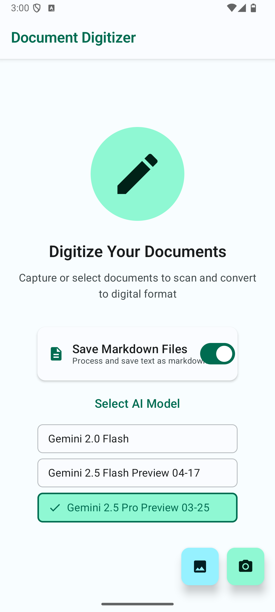
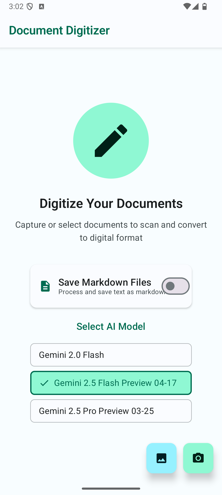
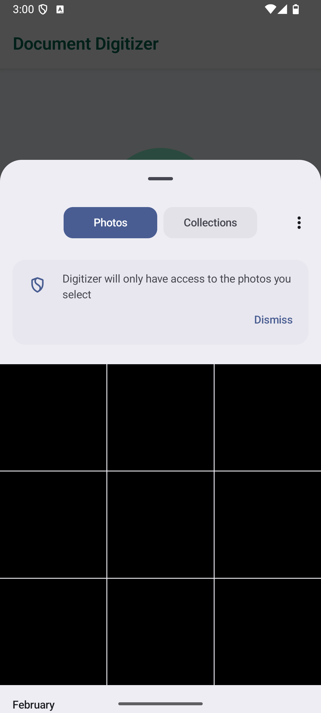

<p align="center">
  
</p>

# Digitizer

An Android document scanner app that uses AI to extract and digitize text from images.

## Features

- **Camera Capture** - Take photos of documents directly
- **Gallery Import** - Select existing images for processing
- **AI-Powered OCR** - Uses Google Gemini AI for accurate text extraction
- **Markdown Export** - Optionally save extracted text as markdown files
- **Batch Processing** - Process multiple documents at once
- **Smart Filenames** - AI suggests appropriate filenames based on content
- **Model Selection** - Choose between different Gemini AI models

## Screenshots

A visual walkthrough of the app on a Pixel-class emulator.


*Launch screen with the default Gemini 2.5 Flash model selected and Save Markdown enabled.*


*Tapping a different model card switches the active Gemini engine for OCR.*


*Gemini 2.5 Pro can be chosen for higher-accuracy extraction on complex documents.*


*The Save Markdown switch controls whether a .md file is written alongside the image.*


*Tapping the blue FAB opens the Android photo picker to batch-select documents.*


*Tapping the green FAB launches the system camera to capture a document directly.*

## How It Works

1. Tap **Camera** to capture a document or **Gallery** to select images
2. AI processes the image and extracts text
3. Review the extracted text and markdown conversion
4. Select a target directory and customize the filename
5. Toggle "Save Markdown" if you want `.md` files alongside images
6. Tap **Save Document** to store the digitized content

## Setup

### API Key Configuration

This app requires a Google Gemini API key.

1. Get an API key from [Google AI Studio](https://makersuite.google.com/app/apikey)
2. Create or edit `local.properties` in the project root:
   ```properties
   apiKey=YOUR_GEMINI_API_KEY_HERE
   ```
3. Build and run the app

The API key is automatically loaded via the `secrets-gradle-plugin` and never committed to version control.

## Permissions

- `CAMERA` - Required to capture document photos
- `READ_EXTERNAL_STORAGE` - Required to access gallery images

## Tech Stack

- **Kotlin** - 100% Kotlin codebase
- **Jetpack Compose** - Modern declarative UI
- **Google Generative AI SDK** - Gemini AI integration
- **Material 3** - Latest Material Design components
- **Secrets Gradle Plugin** - Secure API key management

## Requirements

- Android 9.0 (API 28) or higher
- Google Gemini API key

## Installation

### From Release
1. Download the latest APK from [Releases](../../releases)
2. Install and grant camera/storage permissions
3. Note: You'll need to build from source with your own API key for full functionality

### Build from Source
```bash
git clone https://github.com/sunil-dhaka/Digitizer.git
cd Digitizer
# Add your API key to local.properties
echo "apiKey=YOUR_GEMINI_API_KEY" >> local.properties
./gradlew assembleDebug
```

## Project Structure

```
app/src/main/java/com/example/digitizer/
    MainActivity.kt           # Entry point
    DocumentScannerScreen.kt  # Main UI composable
    BakingViewModel.kt        # AI processing logic
    UiState.kt                # UI state definitions
    FilePicker.kt             # File/directory selection
    PermissionHandler.kt      # Runtime permissions
    ui/theme/                 # Material 3 theming
```

## AI Models

The app supports multiple Gemini models:
- **Gemini 1.5 Flash** - Fast processing (recommended)
- **Gemini 1.5 Pro** - Higher accuracy for complex documents
- **Gemini 2.0 Flash** - Latest model with improved capabilities

## License

MIT License - feel free to use, modify, and distribute.

## Author

Built with Jetpack Compose by [sunil-dhaka](https://github.com/sunil-dhaka)
